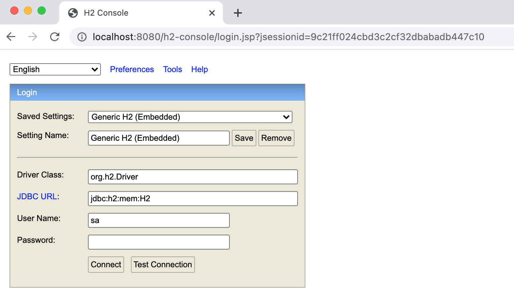

# H2 使用
## h2_001
[Github 传送门]()  
H2 + maven + mybatis + 初始化 sql  
## h2_002
[Github 传送门]()  
H2 + spring boot + mybatis + 单元测试 + 初始化 sql
## h2_003
[Github 传送门]()  
H2 + spring boot web + mybatis + 初始化 sql
